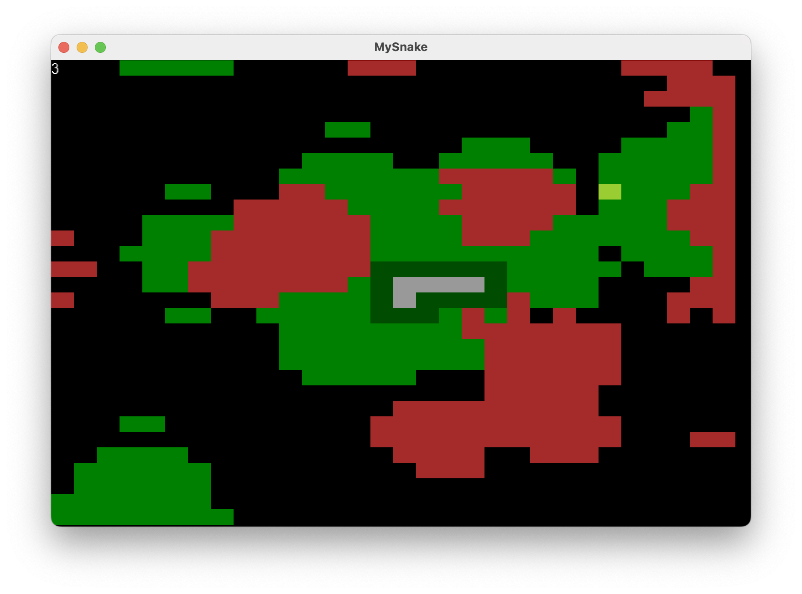

# MySnake

Игра змейка с генерацией карты на Monogame

## Особенности

- Чтобы двигаться тратиться энергия, без энергии змея сьедает себя
- Генерация карты с помощью шума Перлина, игра жизнь, сжатие и рост
- Возможность прятаться в кустах
- Спавн еды несколькими способами

## Что хочется добавить

Карта выглядит как прямоугольник, я задумывал создать несколько таких рядом и провести между ними проходы, для этого уже сделан [Graphs](./Graphs/)

Так же необходимо добавить ИИ для врагов или возможность мультиплеерной игры